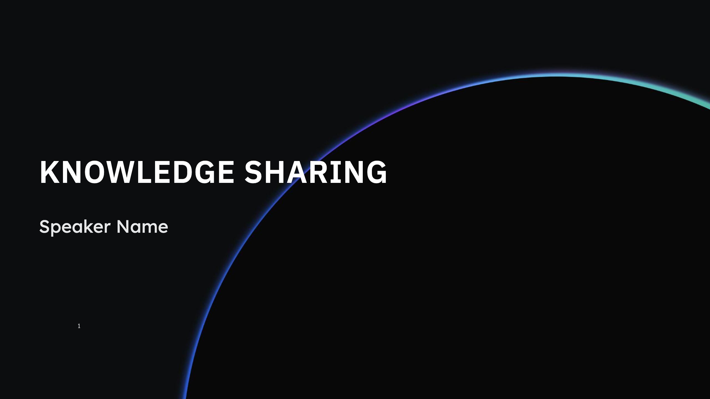
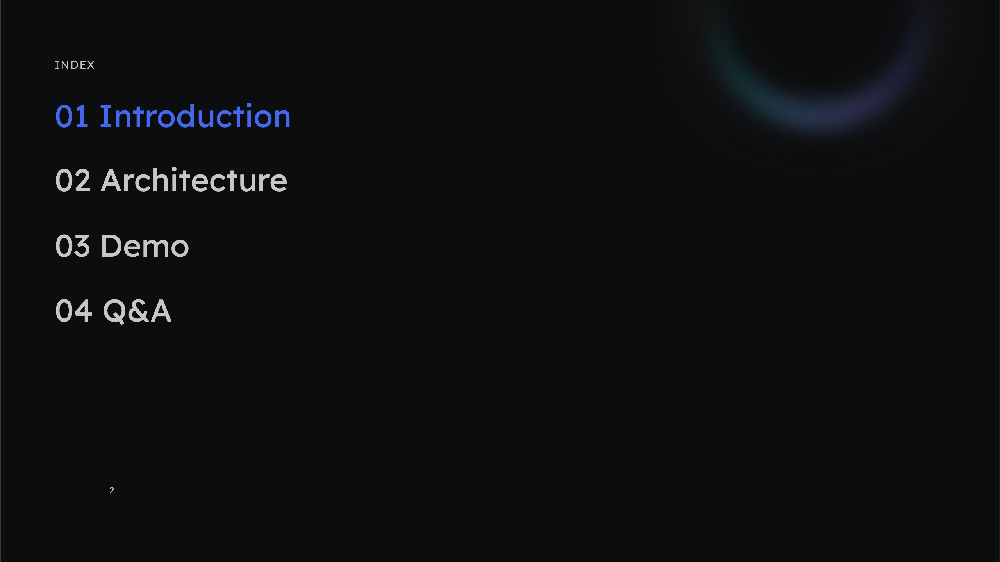
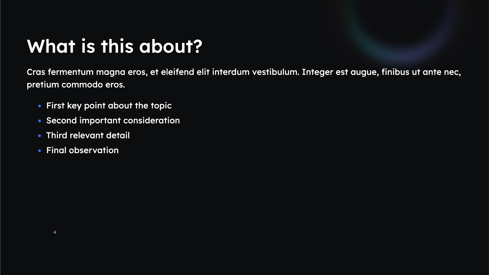
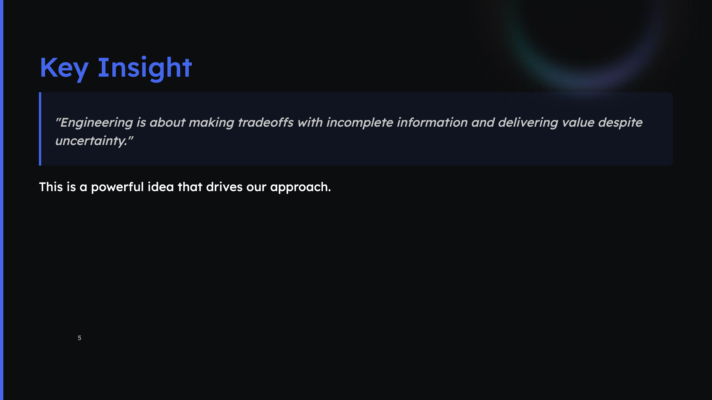
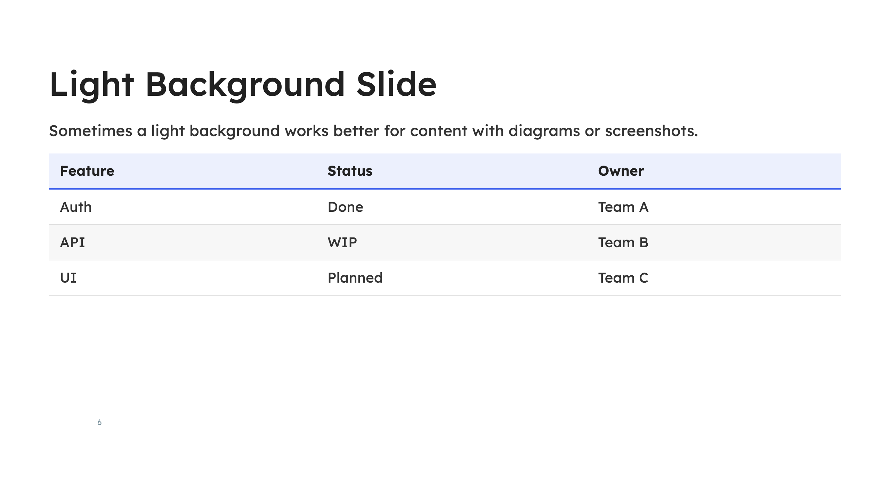
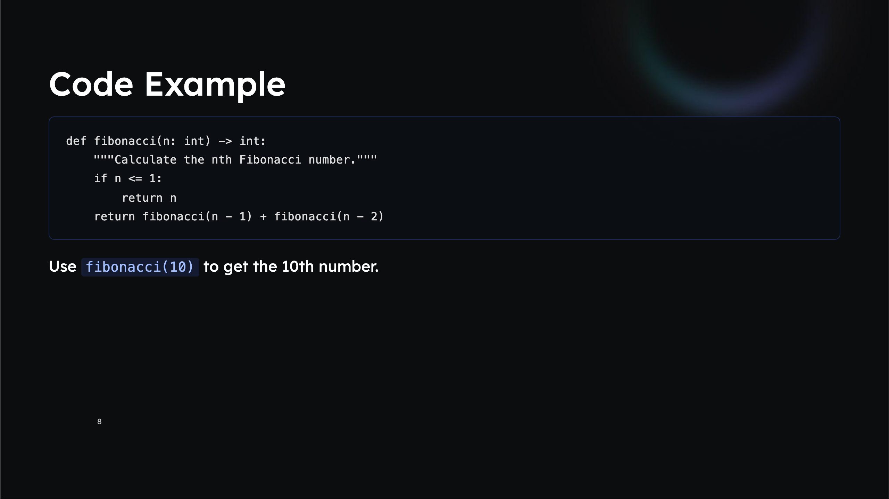

# Orbitant Marp Theme

[Marp](https://marp.app/) theme based on the Orbitant Knowledge Sharing PowerPoint template.

## Preview

|               Title               |               Index               |               Content               |
| :-------------------------------: | :-------------------------------: | :---------------------------------: |
|  |  |  |
|     `<!-- _class: title -->`      |     `<!-- _class: index -->`      |               default               |

|               Accent               |               Light               |               Code               |
| :--------------------------------: | :-------------------------------: | :------------------------------: |
|  |  |  |
|     `<!-- _class: accent -->`      |     `<!-- _class: light -->`      |             default              |

## Setup

```bash
npm install @orbitant/marp-theme @marp-team/marp-cli
```

Create a `.marprc.yml` in your project root so Marp can find the theme:

```yaml
themeSet: node_modules/@orbitant/marp-theme/orbitant.css
html: true
```

> **Important:** Without this config (or the equivalent `--theme-set` CLI flag), Marp won't find the `orbitant` theme and will fall back to the default theme — losing all backgrounds and custom styling.

Now any `.md` file in your project can use the theme:

```markdown
---
marp: true
theme: orbitant
paginate: true
---

<!-- _class: title -->

# My Presentation Title

## Speaker Name

---

# Content Slide

- Point one
- Point two
- Point three
```

Build with:

```bash
npx marp slides.md            # HTML
npx marp --pdf slides.md      # PDF
npx marp --pptx slides.md     # PowerPoint
npx marp --preview slides.md  # Open in browser with live reload
```

Alternatively, you can pass the flag directly:

```bash
npx marp --theme-set node_modules/@orbitant/marp-theme/orbitant.css --preview slides.md
```

## VS Code

Install the [Marp for VS Code](https://marketplace.visualstudio.com/items?itemName=marp-team.marp-vscode) extension, then add to your `.vscode/settings.json`:

```json
{
  "markdown.marp.themes": ["node_modules/@orbitant/marp-theme/orbitant.css"],
  "markdown.marp.enableHtml": true
}
```

You'll get live preview in the editor.

## Slide classes

Use `<!-- _class: classname -->` before a slide to apply a layout:

| Class          | Description                              |
| -------------- | ---------------------------------------- |
| `title`        | Cover slide with full orbital background |
| `section`      | Chapter divider                          |
| `accent`       | Blue left border accent                  |
| `light`        | White background variant                 |
| `light accent` | White background + blue left border      |
| `index`        | Table of contents                        |
| `cols`         | Two-column grid layout                   |
| `lead`         | Large centered text                      |
| `end`          | Closing / thank you slide                |

## Full example

```markdown
---
marp: true
theme: orbitant
paginate: true
---

<!-- _class: title -->

# Knowledge Sharing Title

## Speaker Name

---

<!-- _class: index -->

### Index

# 01 Introduction

## 02 Architecture

## 03 Demo

## 04 Q&A

---

<!-- _class: section -->

# Introduction

## Context and motivation

---

# Regular Content Slide

- Bullet points work as expected
- **Bold** and _italic_ supported
- Links: [example](https://example.com)

---

<!-- _class: accent -->

# Accent Slide

> Blockquotes get a blue left border and subtle background.

---

<!-- _class: light -->

# Light Background

Good for screenshots, diagrams, and tables.

| Feature | Status |
| ------- | ------ |
| Auth    | Done   |
| API     | WIP    |

---

<!-- _class: end -->

# Thank You!

Questions?
```

## Contributing

### Local development

```bash
git clone https://github.com/weorbitant/marp-theme-orbitant.git
cd marp-theme-orbitant
npm install
npm run preview   # Opens example.md with live reload
```

### Releasing a new version

> **Important:** Do not create tags manually with `git tag`. Use the release scripts below so that the tag is created along with a proper GitHub Release via CI/CD.

1. Make sure you are on `main` with all changes committed and pushed
2. Run the appropriate release command:

```bash
npm run release        # patch  0.1.0 → 0.1.1
npm run release:minor  # minor  0.1.0 → 0.2.0
npm run release:major  # major  0.1.0 → 1.0.0
```

This runs `npm version` under the hood, which:

1. Bumps the version in `package.json`
2. Creates a commit and a `v*` tag
3. Pushes both to the remote

The push triggers the [CI/CD pipeline](.github/workflows/publish.yml), which:

1. Validates the tag matches `package.json`
2. Builds and publishes to npm
3. Creates a GitHub Release with auto-generated notes

## Fonts

The theme loads [Lexend](https://fonts.google.com/specimen/Lexend) and [IBM Plex Sans](https://fonts.google.com/specimen/IBM+Plex+Sans) from Google Fonts automatically. No local install needed.
